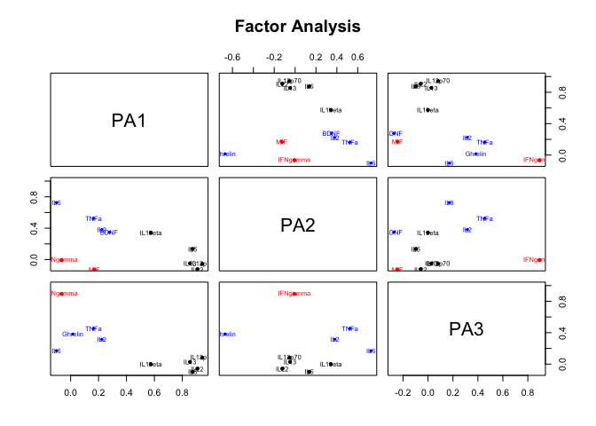
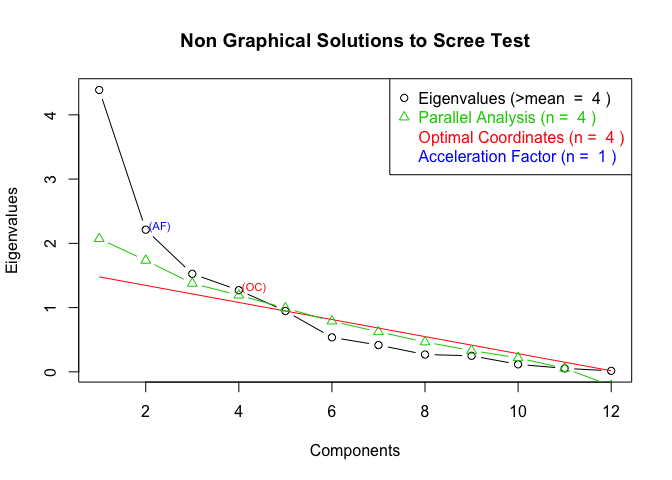

FACTOR-ANALYSIS-plasma
3/8/2019

### FACTOR ANALYSIS

<https://www.statmethods.net/advstats/factor.html>
<http://www.di.fc.ul.pt/~jpn/r/factoranalysis/factoranalysis.html#factor-analysis-vs.pca>

``` r
plasma=read.csv('/Users/xiaoyi/Documents/2018Fall/Clinical/PTSD/plasma.csv',na.strings=c("","NA"))

col=c("id","Timepoints","PTSDorNot","Treatment",  "age" , "biol_sex", grep("Mean",colnames(plasma),value = TRUE))
#prepare data
dat1=plasma[,col]
colnames(dat1)
```

    ##  [1] "id"            "Timepoints"    "PTSDorNot"     "Treatment"    
    ##  [5] "age"           "biol_sex"      "BDNF_Mean"     "IFNgamma_Mean"
    ##  [9] "IL1beta_Mean"  "IL2_Mean"      "IL6_Mean"      "TNFa_Mean"    
    ## [13] "Ghrelin_Mean"  "IL12p70_Mean"  "IL13_Mean"     "IL22_Mean"    
    ## [17] "IL5_Mean"      "MIF_Mean"

``` r
biomvec=grep("Mean",colnames(plasma),value = TRUE)
options(scipen=10000)
```

``` r
data=dat1
for (biom in biomvec){
  ind=which(data[[biom]]<=0&!is.na(data[[biom]]),arr.ind=TRUE)
data[[biom]][ind]=(1/2)*min(data[[biom]][data[[biom]]!=0],na.rm = TRUE)
data[[paste0('log_',biom)]]=log(data[[biom]])

}
```

``` r
data_baseline=data[data$Timepoints==0&!is.na(data$Timepoints),]
na.omit(data_baseline)->data_baseline.omit
bio.mat=data_baseline.omit[,paste0('log_',biomvec)]
demo.mat=data_baseline.omit[,-grep('Mean',colnames(data_baseline))]
```

``` r
library(psych)
```

    ## Warning: package 'psych' was built under R version 3.5.2

``` r
fa.pca <- fa(r = cor(bio.mat), nfactors = 3, rotate = "oblimin", fm = "pa")
```

    ## Loading required namespace: GPArotation

``` r
gsub('log_|_Mean','',colnames(bio.mat))->new.col
colnames(bio.mat)<-new.col
plot(fa.pca,labels=names(bio.mat),cex=.7, ylim=c(-.1,1)) 
```

<!-- -->
\# look at the loadings , the larger the absolute value, the more this
variable explain in this PC

``` r
fa.pca
```

    ## Factor Analysis using method =  pa
    ## Call: fa(r = cor(bio.mat), nfactors = 3, rotate = "oblimin", fm = "pa")
    ## Standardized loadings (pattern matrix) based upon correlation matrix
    ##                     PA1   PA2   PA3   h2   u2 com
    ## log_BDNF_Mean      0.28  0.35 -0.27 0.31 0.69 2.8
    ## log_IFNgamma_Mean -0.06 -0.01  0.89 0.81 0.19 1.0
    ## log_IL1beta_Mean   0.57  0.34  0.00 0.53 0.47 1.6
    ## log_IL2_Mean       0.22  0.38  0.32 0.34 0.66 2.6
    ## log_IL6_Mean      -0.10  0.73  0.17 0.56 0.44 1.2
    ## log_TNFa_Mean      0.16  0.53  0.45 0.57 0.43 2.2
    ## log_Ghrelin_Mean   0.02 -0.67  0.38 0.55 0.45 1.6
    ## log_IL12p70_Mean   0.94 -0.05  0.08 0.86 0.14 1.0
    ## log_IL13_Mean      0.86 -0.05  0.03 0.71 0.29 1.0
    ## log_IL22_Mean      0.91 -0.12 -0.06 0.81 0.19 1.0
    ## log_IL5_Mean       0.87  0.14 -0.10 0.86 0.14 1.1
    ## log_MIF_Mean       0.17 -0.13 -0.24 0.11 0.89 2.4
    ## 
    ##                        PA1  PA2  PA3
    ## SS loadings           3.80 1.76 1.46
    ## Proportion Var        0.32 0.15 0.12
    ## Cumulative Var        0.32 0.46 0.58
    ## Proportion Explained  0.54 0.25 0.21
    ## Cumulative Proportion 0.54 0.79 1.00
    ## 
    ##  With factor correlations of 
    ##       PA1  PA2   PA3
    ## PA1  1.00 0.21 -0.10
    ## PA2  0.21 1.00  0.08
    ## PA3 -0.10 0.08  1.00
    ## 
    ## Mean item complexity =  1.6
    ## Test of the hypothesis that 3 factors are sufficient.
    ## 
    ## The degrees of freedom for the null model are  66  and the objective function was  10.56
    ## The degrees of freedom for the model are 33  and the objective function was  4.43 
    ## 
    ## The root mean square of the residuals (RMSR) is  0.09 
    ## The df corrected root mean square of the residuals is  0.13 
    ## 
    ## Fit based upon off diagonal values = 0.94
    ## Measures of factor score adequacy             
    ##                                                    PA1  PA2  PA3
    ## Correlation of (regression) scores with factors   0.98 0.89 0.95
    ## Multiple R square of scores with factors          0.97 0.80 0.90
    ## Minimum correlation of possible factor scores     0.93 0.59 0.80

``` r
library(nFactors)
```

    ## Loading required package: MASS

    ## Loading required package: boot

    ## 
    ## Attaching package: 'boot'

    ## The following object is masked from 'package:psych':
    ## 
    ##     logit

    ## Loading required package: lattice

    ## 
    ## Attaching package: 'lattice'

    ## The following object is masked from 'package:boot':
    ## 
    ##     melanoma

    ## 
    ## Attaching package: 'nFactors'

    ## The following object is masked from 'package:lattice':
    ## 
    ##     parallel

``` r
ev <- eigen(cor(bio.mat)) # get eigenvalues
ap <- parallel(subject=nrow(bio.mat),var=ncol(bio.mat), rep=100, cent=.05)
nS <- nScree(x=ev$values, aparallel=ap$eigen$qevpea)
plotnScree(nS)
```

<!-- -->

``` r
fit <- principal(bio.mat, nfactors=3, rotate="oblimin")
fit$scores
```

    ##             TC1         TC2         TC3
    ## 22   1.20839915 -1.27729303  0.63450962
    ## 31  -1.37383255 -0.08318149  0.18646829
    ## 50   0.97708153 -1.10905800 -0.44339744
    ## 61   0.35811854  0.17111624 -0.92182338
    ## 82   0.18245876 -0.59129043 -0.04864052
    ## 94  -0.40635500 -0.41067670 -1.23126333
    ## 104 -3.23766748 -0.15570791  0.02586040
    ## 127  0.20436017  1.91656720  0.23069254
    ## 145 -0.53647626 -0.25483078 -0.24563350
    ## 156 -0.49203019  0.05842542  0.45214854
    ## 167 -0.06573006  1.18561194  0.63997390
    ## 178 -0.76256391 -0.90996061  0.75383684
    ## 195  0.69466836 -0.51615336 -0.09737343
    ## 214  0.16631923 -0.40523031  0.38313978
    ## 234  0.65984928 -0.34745984 -0.93973587
    ## 245  0.80146860 -2.08109728  1.57588560
    ## 256  0.72534363  1.57871009  0.82583333
    ## 267  1.27001388  1.33294891  2.25179297
    ## 276  0.13918901 -0.45509570 -2.21036473
    ## 287  0.55857142  1.15712045  0.36876353
    ## 298 -0.31322949  0.30567941 -1.04633843
    ## 308 -0.75795664  0.89085578 -1.14433473

``` r
fit$loadings
```

    ## 
    ## Loadings:
    ##          TC1    TC2    TC3   
    ## BDNF      0.247 -0.283  0.627
    ## IFNgamma         0.802 -0.285
    ## IL1beta   0.657  0.183  0.266
    ## IL2       0.286  0.613  0.185
    ## IL6      -0.140  0.436  0.701
    ## TNFa      0.155  0.634  0.384
    ## Ghrelin          0.142 -0.819
    ## IL12p70   0.950              
    ## IL13      0.918        -0.125
    ## IL22      0.904 -0.145       
    ## IL5       0.878         0.165
    ## MIF       0.163 -0.521       
    ## 
    ##                  TC1   TC2   TC3
    ## SS loadings    3.986 2.055 1.949
    ## Proportion Var 0.332 0.171 0.162
    ## Cumulative Var 0.332 0.503 0.666

``` r
##?question:how to deal with id ?
## id is not needed because lmm must have repeative measurement on same subject, this baseline only have one.
pcr.fit.ex = lm(fit$scores[,1] ~ PTSDorNot+Treatment+age+ biol_sex,data=demo.mat) 
summary(pcr.fit.ex)
```

    ## 
    ## Call:
    ## lm(formula = fit$scores[, 1] ~ PTSDorNot + Treatment + age + 
    ##     biol_sex, data = demo.mat)
    ## 
    ## Residuals:
    ##      Min       1Q   Median       3Q      Max 
    ## -2.48790 -0.50187  0.07509  0.54774  1.41952 
    ## 
    ## Coefficients:
    ##               Estimate Std. Error t value Pr(>|t|)
    ## (Intercept)   0.485485   0.887633   0.547    0.592
    ## PTSDorNot    -0.452880   0.487321  -0.929    0.366
    ## Treatment    -0.595232   0.432180  -1.377    0.186
    ## age          -0.006931   0.024084  -0.288    0.777
    ## biol_sexMale  0.385790   0.436187   0.884    0.389
    ## 
    ## Residual standard error: 1.001 on 17 degrees of freedom
    ## Multiple R-squared:  0.1893, Adjusted R-squared:  -0.001421 
    ## F-statistic: 0.9925 on 4 and 17 DF,  p-value: 0.4382
