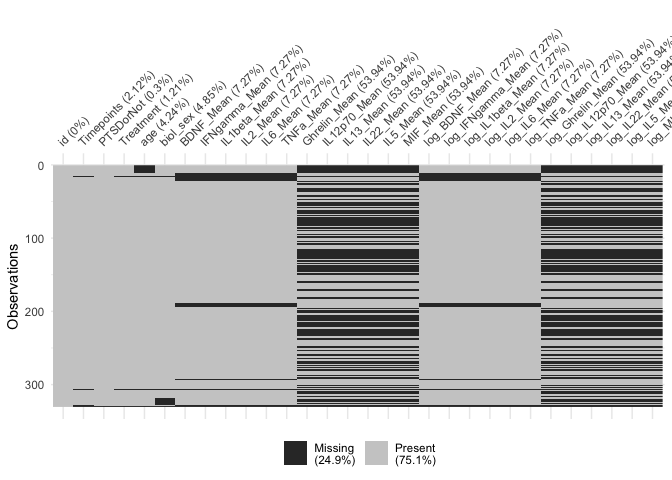
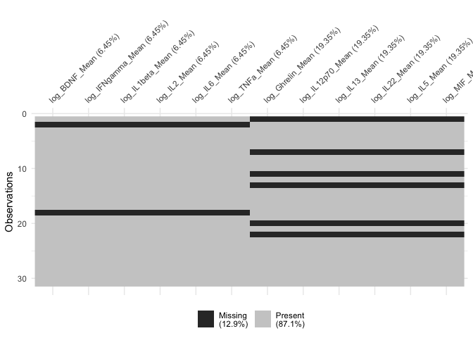
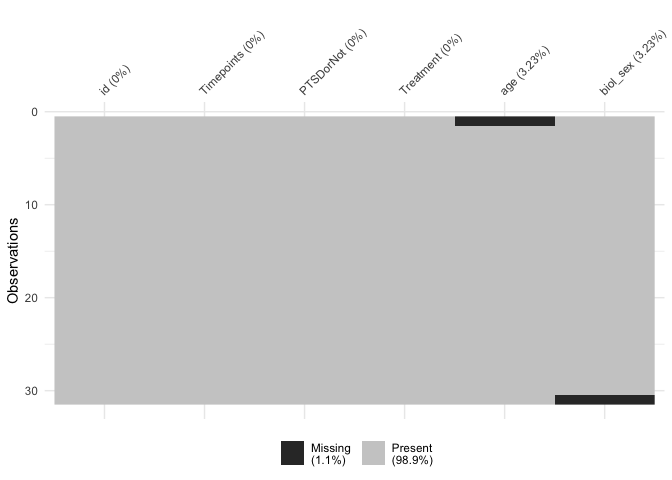
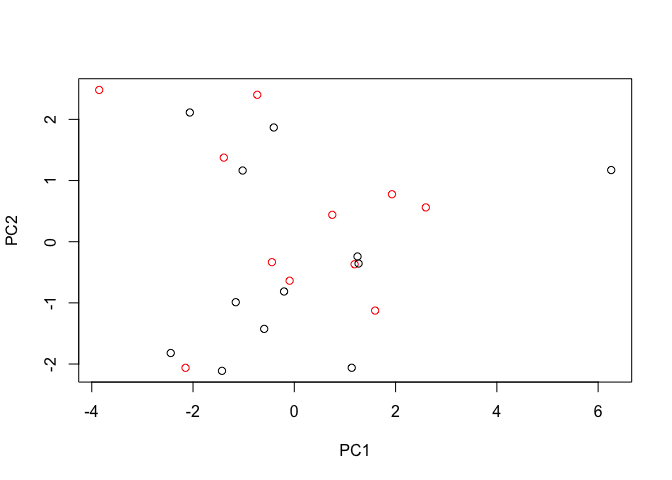
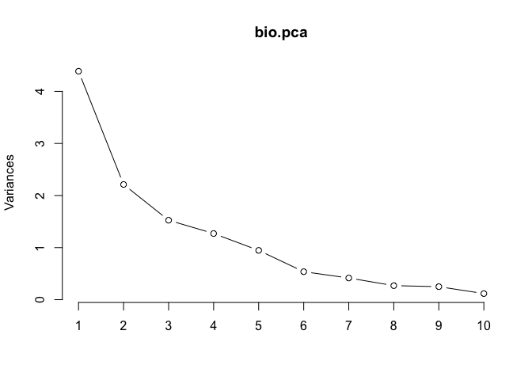
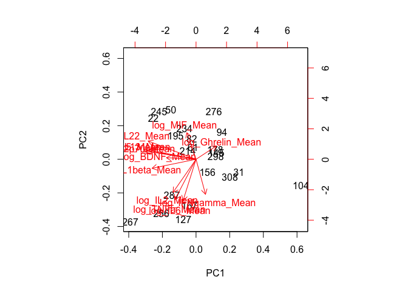

pca\_plasma
================
YI XIAO
3/4/2019

``` r
plasma=read.csv('/Users/xiaoyi/Documents/2018Fall/Clinical/PTSD/plasma.csv',na.strings=c("","NA"))

col=c("id","Timepoints","PTSDorNot","Treatment",  "age" , "biol_sex", grep("Mean",colnames(plasma),value = TRUE))
#prepare data
dat1=plasma[,col]
colnames(dat1)
```

    ##  [1] "id"            "Timepoints"    "PTSDorNot"     "Treatment"    
    ##  [5] "age"           "biol_sex"      "BDNF_Mean"     "IFNgamma_Mean"
    ##  [9] "IL1beta_Mean"  "IL2_Mean"      "IL6_Mean"      "TNFa_Mean"    
    ## [13] "Ghrelin_Mean"  "IL12p70_Mean"  "IL13_Mean"     "IL22_Mean"    
    ## [17] "IL5_Mean"      "MIF_Mean"

``` r
biomvec=grep("Mean",colnames(plasma),value = TRUE)
options(scipen=10000)
#
#RECODE  the 1,0 into PTSD active 
#dat1$Group=ifelse(dat1$PTSDorNot==1,'PTSD','non-PTSD')
#dat1$Treatment_new=ifelse(dat1$Treatment==1,'active','sham')
#dat1$PTSDorNot=factor(dat1$PTSDorNot)
#col1,col2 combination to split data 
```

\#create a dataset impute zero and log

``` r
data=dat1
for (biom in biomvec){
  ind=which(data[[biom]]<=0&!is.na(data[[biom]]),arr.ind=TRUE)
data[[biom]][ind]=(1/2)*min(data[[biom]][data[[biom]]!=0],na.rm = TRUE)
data[[paste0('log_',biom)]]=log(data[[biom]])

}
```

``` r
 library(visdat)
vis_miss(data)
```

<!-- -->

``` r
data_baseline=data[data$Timepoints==0&!is.na(data$Timepoints),]
bio.mat=data_baseline[,paste0('log_',biomvec)]
vis_miss(bio.mat)
```

<!-- -->

``` r
demo.mat=data_baseline[,-grep('Mean',colnames(data_baseline))]
```

``` r
vis_miss(demo.mat)
```

<!-- -->

\#deal with missing with remove or impute

``` r
#one method : remove na 
 na.omit(bio.mat)->bio.na.omit
#two method:mean
impute.mean<-function(data){
for(i in 1:ncol(data)){
  data[is.na(data[,i]), i] <- mean(data[,i], na.rm = TRUE)
}
  return(data)
}
impute.mean(bio.mat)->bio.na.mean
```

## impute

``` r
bio.pca=prcomp(bio.na.omit,
                 center = TRUE,
                 scale. = TRUE)
plot(bio.pca,type = "l")
```

<!-- -->

``` r
head(bio.pca)
```

    ## $sdev
    ##  [1] 2.0882878 1.4717743 1.2267819 1.1116920 1.0404299 0.7207392 0.6326609
    ##  [8] 0.5403648 0.4972184 0.3497969 0.2291144 0.1256623
    ## 
    ## $rotation
    ##                           PC1         PC2          PC3          PC4
    ## log_BDNF_Mean     -0.25222729  0.01540465 -0.438264049  0.202534986
    ## log_IFNgamma_Mean  0.07307135  0.41851101  0.498877449  0.164150774
    ## log_IL1beta_Mean  -0.36917988  0.09048742  0.007093822 -0.115843886
    ## log_IL2_Mean      -0.17870040  0.33221185  0.215914186  0.004412856
    ## log_IL6_Mean      -0.12217488  0.49626152 -0.283158564  0.107400276
    ## log_TNFa_Mean     -0.18040570  0.47414927  0.098991828  0.327955139
    ## log_Ghrelin_Mean   0.17757791 -0.17290927  0.582991522  0.089654606
    ## log_IL12p70_Mean  -0.42005010 -0.08773638  0.164914665 -0.239058623
    ## log_IL13_Mean     -0.39860314 -0.10775435  0.157866638 -0.361493344
    ## log_IL22_Mean     -0.39724229 -0.23002125  0.159924261  0.184003584
    ## log_IL5_Mean      -0.43439405 -0.13034572  0.068986855  0.196826549
    ## log_MIF_Mean      -0.04451229 -0.34038134  0.008106115  0.728726979
    ##                           PC5         PC6         PC7         PC8
    ## log_BDNF_Mean     -0.40247318 -0.14074586  0.67501652 -0.09008684
    ## log_IFNgamma_Mean -0.16947737  0.29653191  0.05650399 -0.42110484
    ## log_IL1beta_Mean   0.41299136  0.27565979  0.35395790 -0.34528508
    ## log_IL2_Mean       0.55567805 -0.56465174  0.20995111  0.23215708
    ## log_IL6_Mean      -0.19909379 -0.41507150 -0.42609555 -0.38597572
    ## log_TNFa_Mean     -0.16335779  0.34736067  0.02963403  0.58975910
    ## log_Ghrelin_Mean  -0.30616654 -0.38529439  0.28461396 -0.11649920
    ## log_IL12p70_Mean  -0.24477749 -0.02588536 -0.09955491  0.14326561
    ## log_IL13_Mean     -0.09903060  0.09399657 -0.03257752 -0.09887453
    ## log_IL22_Mean     -0.17959208 -0.20156316 -0.19757563  0.19506486
    ## log_IL5_Mean       0.09105711  0.06320510 -0.23202407 -0.21816796
    ## log_MIF_Mean       0.24417813  0.04377175 -0.06715542 -0.12297356
    ##                           PC9        PC10        PC11        PC12
    ## log_BDNF_Mean      0.20596339 -0.09447634  0.07732596  0.01285634
    ## log_IFNgamma_Mean  0.48909765  0.05844573 -0.01507116  0.06041210
    ## log_IL1beta_Mean  -0.41172905  0.39418875 -0.15077250  0.05789661
    ## log_IL2_Mean       0.25358724 -0.13594671  0.03069803 -0.04179266
    ## log_IL6_Mean      -0.25421592  0.02526392 -0.18586282 -0.06941088
    ## log_TNFa_Mean     -0.33692808 -0.12287660 -0.02087834 -0.01371248
    ## log_Ghrelin_Mean  -0.49646404 -0.03410540  0.05766470 -0.05403313
    ## log_IL12p70_Mean   0.16582380  0.31629120 -0.01319170 -0.71608687
    ## log_IL13_Mean     -0.00978637 -0.66869114 -0.42476094  0.12945990
    ## log_IL22_Mean      0.15361489  0.41542430 -0.17548411  0.59406960
    ## log_IL5_Mean      -0.08002381 -0.24273242  0.75527347  0.03650146
    ## log_MIF_Mean       0.04814365 -0.13493551 -0.38727789 -0.31522952
    ## 
    ## $center
    ##     log_BDNF_Mean log_IFNgamma_Mean  log_IL1beta_Mean      log_IL2_Mean 
    ##         4.6821792         0.7317643        -3.1594380        -4.0715824 
    ##      log_IL6_Mean     log_TNFa_Mean  log_Ghrelin_Mean  log_IL12p70_Mean 
    ##        -0.3978310         0.9052337         5.8817701         0.9018655 
    ##     log_IL13_Mean     log_IL22_Mean      log_IL5_Mean      log_MIF_Mean 
    ##         3.6214448         0.6995898         0.6563582         9.6253061 
    ## 
    ## $scale
    ##     log_BDNF_Mean log_IFNgamma_Mean  log_IL1beta_Mean      log_IL2_Mean 
    ##         1.3875481         1.2431876         1.1129526         1.6670576 
    ##      log_IL6_Mean     log_TNFa_Mean  log_Ghrelin_Mean  log_IL12p70_Mean 
    ##         0.5576505         0.3630953         0.7368345         0.8350184 
    ##     log_IL13_Mean     log_IL22_Mean      log_IL5_Mean      log_MIF_Mean 
    ##         0.7448367         0.6196298         0.5357933         0.9482956 
    ## 
    ## $x
    ##             PC1        PC2         PC3         PC4        PC5         PC6
    ## 22  -2.44017466 -1.8202622 -0.94219512 -0.08679303  0.6450140 -0.88813024
    ## 31   2.59700218  0.5605765 -0.76480988  0.63912339  0.2268547 -0.20191698
    ## 50  -1.42831404 -2.1115232  0.17020514  0.04016971 -1.4104245 -0.78785755
    ## 61  -0.09253738 -0.6377913  1.42588373 -0.11467574  0.5888794 -0.90465716
    ## 82  -0.20240219 -0.8139271 -0.16767543  0.56809685 -0.6424425  1.26233868
    ## 94   1.59621352 -1.1259241  0.90358689  0.32132103 -1.6830895 -0.69948144
    ## 104  6.25819618  1.1714658 -1.53505708  1.17956150 -0.3438167 -0.73366926
    ## 127 -0.73205383  2.4018678  1.57220881  1.10996717  0.1404610  0.69283217
    ## 145  1.24812965 -0.2418881 -0.07815875  0.48481903 -0.7406711  0.23019853
    ## 156  0.74976483  0.4393829 -0.49111218  0.22227017  2.2560546  0.57504342
    ## 167 -0.40581026  1.8674027 -0.39808175 -1.81557128  0.3134977 -0.69173553
    ## 178  1.19093785 -0.3686997 -1.77908891  0.31362332  0.5859590  0.89518254
    ## 195 -1.15621399 -0.9890204  0.24296840  0.53595997 -0.4959192  0.96570177
    ## 214 -0.44215401 -0.3342750 -0.45800079  0.70595082 -0.5290991  0.64152203
    ## 234 -0.59480829 -1.4256783  1.29112501 -0.04689015  1.5497511  0.93576104
    ## 245 -2.14824370 -2.0619711 -2.98434411 -0.63390577  0.7227697 -0.29915574
    ## 256 -2.06335462  2.1124404  0.33415837 -1.04706102  0.4712420 -0.59786120
    ## 267 -3.85306936  2.4810272 -0.42278512  1.88520945 -0.5828087 -0.23104007
    ## 276  1.13379694 -2.0613588  2.21850975 -0.15216480 -0.6850960 -0.01119001
    ## 287 -1.39215281  1.3746977  0.85292404  0.52456258 -0.2659613 -0.23823094
    ## 298  1.26897616 -0.3566811  1.50444231  0.17462787  2.0114871 -0.91044492
    ## 308  1.92883836  0.7762014  0.51548328 -3.47681196 -0.4850157  0.88069619
    ## 319 -1.02056653  1.1639380 -1.01018660 -1.33138910 -1.6476260  0.11609467
    ##             PC7         PC8         PC9        PC10        PC11
    ## 22   0.79658465 -0.32741687  0.88593964 -0.19858413  0.12151006
    ## 31   0.97983091 -0.67971892 -0.19319904 -0.53907948 -0.34008059
    ## 50   0.64643593 -0.29125211 -0.75234217  0.02451709  0.30730769
    ## 61   0.49270970  0.15365394 -0.17330221  0.57386298 -0.40043584
    ## 82   1.10055878  0.97135584  0.05983069  0.02129598  0.29160266
    ## 94  -1.05029563  0.58862579  0.62054979 -0.51333058 -0.10626692
    ## 104 -0.08421801  0.16396682  0.06626881  0.60777229  0.33469359
    ## 127 -0.73724382 -1.09319887 -0.02579245  0.14636631  0.26004762
    ## 145  0.34317113  0.06495307 -0.27048520  0.03761776 -0.46771054
    ## 156 -0.06085779  0.15920034  0.53279532  0.16260180 -0.13772325
    ## 167  0.29416207  0.52356137  0.70335230 -0.27195316  0.26939814
    ## 178 -0.43205566  0.16657550  0.08663329 -0.42436415 -0.05171401
    ## 195  0.57367431 -0.70515844  0.26332919  0.10845084  0.11468408
    ## 214  0.01070550 -0.45768068  0.09874813 -0.02943794 -0.20903354
    ## 234 -0.24733477  0.54642371 -0.04009645  0.20505626  0.11657848
    ## 245 -1.30021609 -0.02691437 -0.64391116  0.30835836 -0.04188268
    ## 256  0.17902033 -0.16166275  0.49751993  0.32789470 -0.17105520
    ## 267 -0.50251232  0.55874669 -0.25169643 -0.47486586 -0.04870399
    ## 276 -0.90338710 -0.12981331  0.62700133  0.12540317 -0.04493422
    ## 287  0.23679478  0.95828806 -0.67064601  0.33600694 -0.06225035
    ## 298 -0.10669212 -0.39923084 -0.83695578 -0.55231378  0.25955879
    ## 308 -0.02624966  0.09160667 -0.64383139 -0.28948106 -0.03921747
    ## 319 -0.20258512 -0.67491062  0.06028987  0.30820566  0.04562750
    ##             PC12
    ## 22   0.099161379
    ## 31   0.100071081
    ## 50   0.002792167
    ## 61  -0.306275547
    ## 82   0.119215677
    ## 94   0.044084707
    ## 104 -0.059057686
    ## 127  0.045953456
    ## 145  0.101742711
    ## 156  0.115026921
    ## 167 -0.139874182
    ## 178 -0.167566320
    ## 195 -0.258665518
    ## 214 -0.013316577
    ## 234  0.013753862
    ## 245  0.034040661
    ## 256  0.107036179
    ## 267 -0.140337059
    ## 276  0.052428168
    ## 287  0.150404888
    ## 298  0.045204077
    ## 308 -0.051318550
    ## 319  0.105495507

``` r
VE <- bio.pca$sdev^2
PVE <- VE / sum(VE)
round(PVE, 2)
```

    ##  [1] 0.36 0.18 0.13 0.10 0.09 0.04 0.03 0.02 0.02 0.01 0.00 0.00

``` r
plot(bio.pca$x[, 1:2],col=c(1,2))
```

<!-- -->

\#\#rm all data with na in both demo\&biomarker

``` r
na.omit(data_baseline)->data_baseline.omit
bio.mat=data_baseline.omit[,paste0('log_',biomvec)]
demo.mat=data_baseline.omit[,-grep('Mean',colnames(data_baseline))]
bio.pca=prcomp(bio.mat,
                 center = TRUE,
                 scale. = TRUE)
plot(bio.pca,type = "l")
```

<!-- -->

``` r
VE <- bio.pca$sdev^2
PVE <- VE / sum(VE)
round(PVE, 2)
```

    ##  [1] 0.37 0.18 0.13 0.11 0.08 0.04 0.03 0.02 0.02 0.01 0.00 0.00

``` r
biplot(bio.pca)
```

<!-- -->

``` r
pcr.fit = lm(bio.pca$x[,1] ~ .,data=demo.mat) 
summary(pcr.fit)
```

    ## 
    ## Call:
    ## lm(formula = bio.pca$x[, 1] ~ ., data = demo.mat)
    ## 
    ## Residuals:
    ##     Min      1Q  Median      3Q     Max 
    ## -3.3124 -0.7946 -0.1779  0.7177  4.9130 
    ## 
    ## Coefficients: (1 not defined because of singularities)
    ##              Estimate Std. Error t value Pr(>|t|)
    ## (Intercept)   0.13151    7.89161   0.017    0.987
    ## id           -0.01070    0.05778  -0.185    0.855
    ## Timepoints         NA         NA      NA       NA
    ## PTSDorNot     0.60622    1.11823   0.542    0.595
    ## Treatment     0.92545    0.97799   0.946    0.358
    ## age           0.02843    0.05862   0.485    0.634
    ## biol_sexMale -0.81788    1.02974  -0.794    0.439
    ## 
    ## Residual standard error: 2.216 on 16 degrees of freedom
    ## Multiple R-squared:  0.1474, Adjusted R-squared:  -0.1191 
    ## F-statistic: 0.553 on 5 and 16 DF,  p-value: 0.7341
